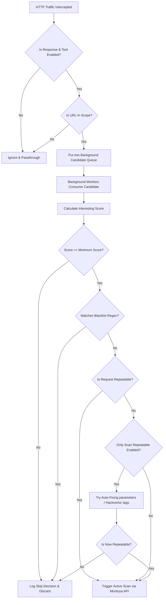

# Pentagrid Scan Controller

A powerful Burp Suite extension designed to optimize, filter, and supercharge automated and semi-automated Active Scanning. 

Originally created by Tobias "floyd" Ospelt (@floyd_ch) from Pentagrid AG, this extension has been fully modernized to utilize the latest **Burp Suite Montoya API** for seamless compatibility, classloader isolation, and peak performance.

---

## 🚀 Key Features

*   **Intelligent Active Scan Filtering**: Prevent wasteful and senseless scanning (e.g., active scanning static `.js`, `.css`, or `.png` files, or scanning uninteresting HTTP methods).
*   **Automatic Repeatability Testing**: Dynamically tests if requests are repeatable before passing them to the scanner.
*   **Smart Parameter Fixes**: Automatically attempts to make requests repeatable using custom regex fixing and [Hackvertor](https://github.com/hackvertor/hackvertor) tags.
*   **Zero UI Regression**: Features a full Swing interface mapping interesting scores, scan status tables, custom logging entries, and real-time configuration tuning.
*   **Montoya API Powered**: Zero dependency conflicts with legacy classloaders, packaged as a modern Java SPI service provider.

---

## 🔍 Workflow Architecture

Below is the workflow showing how the extension intelligently intercepts, processes, and decides whether to scan incoming HTTP requests:



---

## 📋 Prerequisites & Requirements

Before building or running this extension, ensure you have:

1.  **Burp Suite**: Professional or Community Edition (v2023.1 or newer recommended).
2.  **Java Development Kit (JDK)**: **Java 21** or higher installed on your system (Adoptium Temurin is highly recommended).
3.  **Hackvertor Extension**: This extension relies on Hackvertor tags to make requests repeatable. Install **Hackvertor** via the Burp Suite BApp Store before loading this extension.

---

## 🛠️ Compiling & Building

We provide an automated and clean build automation script.

To compile and package the extension into a single **Fat JAR**, simply run the executable build script in the root directory:

```bash
chmod +x build.sh
./build.sh
```

### What the build script does:
1.  Cleans all previous build caches and libraries.
2.  Compiles the Kotlin classes targeting **Java 21 JVM**.
3.  Packages all necessary dependencies (including Klaxon, Kotlin serialization library) into a relocatable, self-contained JAR.
4.  Outputs the final verified JAR at:
    `build/libs/PentagridScanController-0.2.jar`

---

## 📥 Installation in Burp Suite

To install the compiled extension in Burp Suite, follow these simple steps:

1.  Open **Burp Suite**.
2.  Go to the **Extensions** tab -> **Installed** (previously called *Extender* -> *Extensions*).
3.  Click the **Add** button.
4.  Set **Extension type** to **Java**.
5.  Click **Select file ...** and choose the compiled JAR file:
    `[PROJECT-PATH]/build/libs/PentagridScanController-0.2.jar`
6.  Click **Next**. The extension will load instantly.
7.  Verify that:
    *   The extension name appears in the table as **Pentagrid Scan Controller**.
    *   The **Scan** tab is added to your main top tab bar in Burp Suite.
    *   No errors are printed in the extension output/error streams.

> [!WARNING]
> Ensure that the **Hackvertor** extension is listed **after** (or loaded before) the **Pentagrid Scan Controller** extension in your loaded extensions list, so that the custom tags are correctly parsed by Burp.

---

## 📖 How to Use

1.  **Configure Target Scope**: Add the target host/website to your Burp Suite target scope.
2.  **Enable Proxy Interception**: In the top **Scan** tab, go to **Options** -> **Requests to process** and check **Proxy requests**.
3.  **Browse Naturally**: Walk through the target web application naturally using Burp's built-in browser.
4.  **Analyze & Filter**: The extension will dynamically analyze each request:
    *   Requests with high "Interesting" scores will be prioritized.
    *   Static, repetitive, or uninteresting resources will be safely filtered out.
    *   Look at the **Pentagrid Scan Controller** main table to review individual decisions and scores.
    *   Sort by the **Reason** column to inspect decisions (e.g. `GET to uninteresting file extension`, `Repeatability broke before scanning`).

---

## 📝 Changelog

### Version 0.2 (May 2026) - Burp Montoya API Migration
*   **Modern API Migration**: Completely ported the extension to the modern **Burp Montoya API**, fully eliminating `IBurpExtender` class-loader conflicts and preventing `ClassCastException` issues.
*   **Java SPI Service Discovery**: Added the `META-INF/services/burp.api.montoya.BurpExtension` service file to allow automatic discovery and reliable loading of the extension class by Burp Suite.
*   **Montoya Bridge Layer (`burp.MontoyaBridge.kt`)**: Implemented a comprehensive adapter bridging modern Montoya interfaces back to the original `IBurpExtenderCallbacks` and `IExtensionHelpers`:
    *   Mapped standard logging and output streams to `api.logging().output()` and `api.logging().error()`.
    *   Bridged persistent settings and UI state directly to Montoya's secure preferences engine `api.persistence().preferences()`.
    *   Linked active scanning requests directly to Montoya's core audit system `api.scanner().startAudit()`.
    *   Interfaced JTable UI tabs, custom menus, and message viewers with Montoya's user interface handlers `api.userInterface()`.
*   **Enhanced Testability**: Decoupled core similarity logic in `Similarity.kt` from strict Swing initialization dependencies, introducing full headless **JUnit 5** testing verification capability.
*   **Build Infrastructure**: Upgraded Kotlin compiler to `2.0.20`, standard library serialization to `1.6.3`, and set Java target toolchain compilation pipeline strictly to **Java 21**.

### Version 0.1 - Initial Legacy Release
*   Initial release using legacy Burp Extender API with support for Hackvertor tags, proxy scan scheduling, and repeatable request detection.

---

## 🛡️ License & Attributions

*   Original Author: **Tobias "floyd" Ospelt**
*   Company: **Pentagrid AG** (https://www.pentagrid.ch)
*   Released under the terms of the project's original license.
